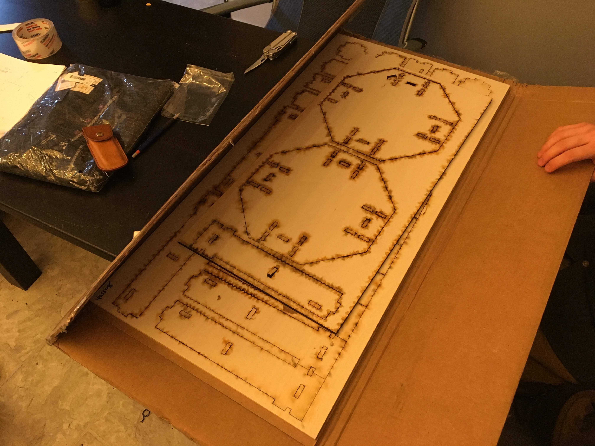

# "Harpoon Lagoon" Drone Design Journal

We set out on this project with the intention of creating a fully autonomous drone.

After discussion with others who had done similar projects, we decided to use a Raspberry Pi as the main control. 
Both authors familiarity with Python, and the desire for aditional functionality of video processing solidified this choice.

Before purchasing components, an analysis of the weight of the frame, electrical components, and other pieces was conducted to ensure that the thrust provided by the motors would be enough to allow the drone to be reasonably maneuvreable.

After purchasing components, one of the first steps was to create a program which could run our motors and read data from our gyroscope.

The real complexity comes from the control system.

We have decided on using a PID controller to control each of the axis the drone can move in.

It is complicated by the fact that a drone makes each of it's movements in a different way.

A drone yaws by increasing the speed of two rotors and decreasing the others.

A drone moves laterally by tipping towards one direction and accelerating, while trying to not lose height.

A drone moves vertically by speeding up all of its motors.

Balancing the needs of all of these movements to allow the drone to move smoothly is the main current concern.

While the software side was being designed, the drone frame itself was designed and sent to be laser cut

The drone was then assemebled using super-glue.

